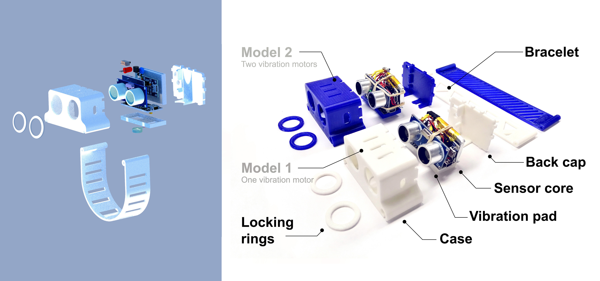
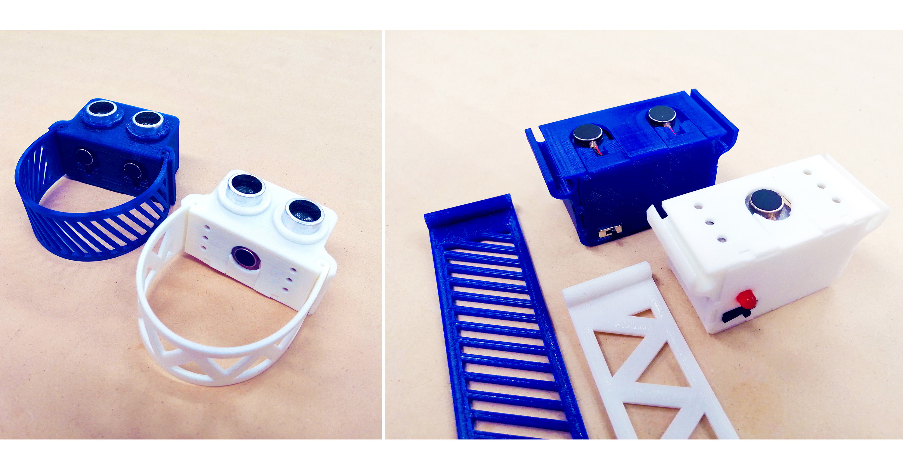
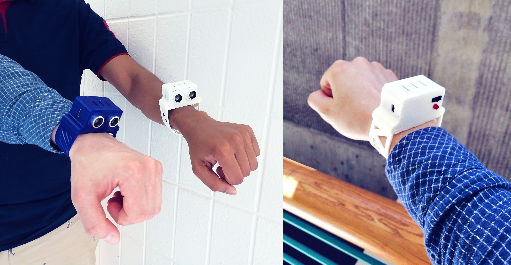
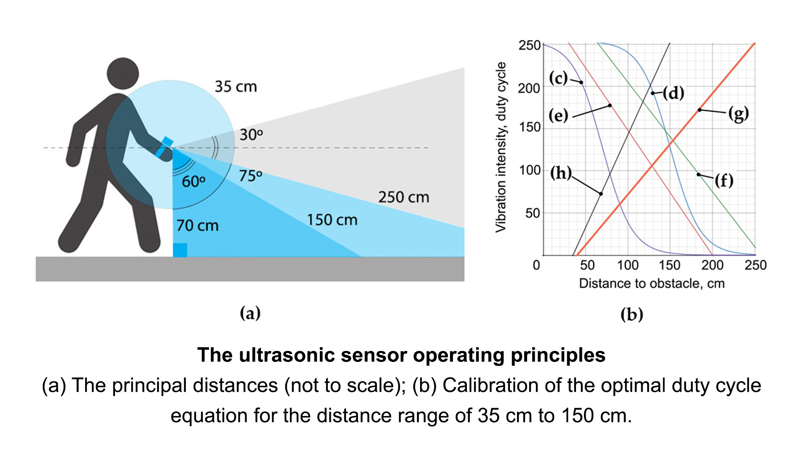
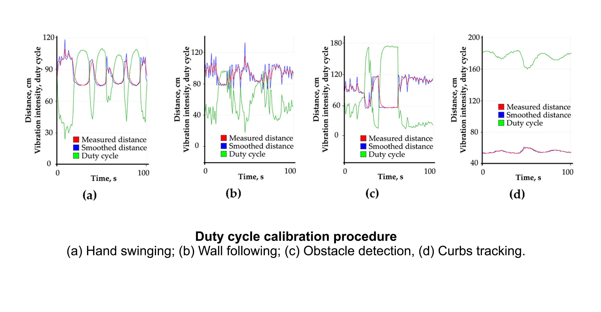
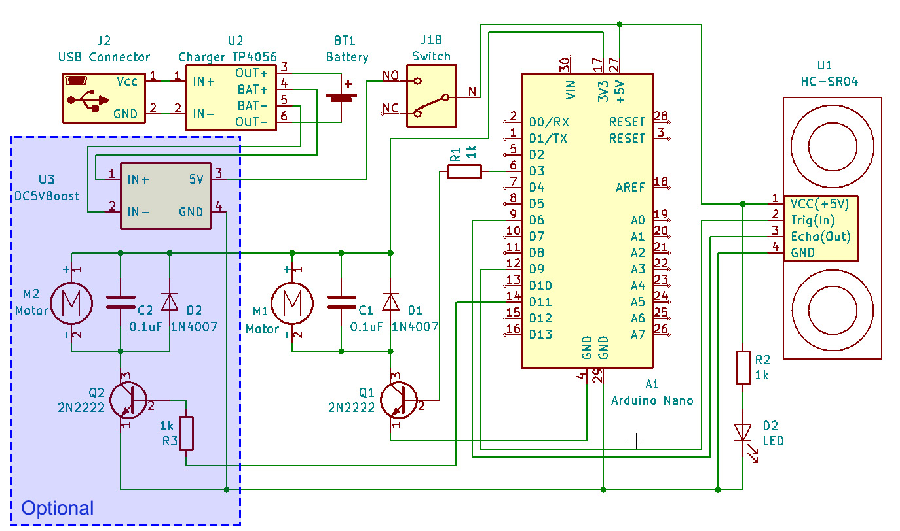

# Low-cost open source ultrasound-sensing based navigational support for visually impaired

 >*The given material is a part of the "Low-cost open source ultrasound-sensing based navigational support for visually impaired" paper by  Aliaksei L. Petsiuk and Joshua M. Pearce.*

The system conveys point-distance information by utilizing the natural active sensing approach and modulates measurements into haptic feedback with various vibration patterns within the distance range of 3 meters.

   
**Figure 1.** Parts of an open-source navigational support with 3-D printable case components: (a) 3D prototype; (b) Assembly; (c) Model 1 with one vibration motor; (d) Model 2 with two vibration motors; (e) Locking rings; (f) Case; (g) Vibration pad; (h) Sensor core; (i) Back cap; (j) Bracelet.
 

**Figure 2.** Assembly of an open-source navigational support with 3-D printable case components.
    

   
**Figure 3.** Devices in use
    

## Project description
Assembly instructions are available at  [appropedia page](https://www.appropedia.org/Low-cost_open_source_ultrasound-sensing_based_navigational_support_for_visually_impaired).   

**Figure 4.** The ultrasonic sensor operating principles: (a) The principal distances (not to scale); (b) Calibration of the optimal duty cycle equation for the distance range of 35 cm to 150 cm, where (c) M DC = 127 + 127 · tanh (-(D - 70) / 35); (d) M DC = 127 + 127 · tanh (-(D - 150) / 35); (e) M DC = 296 – 1.5 · D; (f) M DC = 335 – 1.3 · D; (g) M DC = -77 + 2.2 · D; (h) M DC = -48 + 1.2 · D.
    

The measured distance is modulated with vibration amplitude and translated in real-time as a duty cycle parameter from the Arduino board (Figure 4, a). Distances up to 35 cm are characterized by single vibration pulses with a relatively high frequency. Distances from 150 to 250 cm are characterized by single pulses with low periodicity, and distances above 250 cm are modulated with two-pulse beats (Figure 4, b). An optimal duty cycle equation for the most common distance range of 35-150 cm was found during experiments and calibrations (Figure 5). The generated duty cycle for the Arduino output, M DC is:    
M DC = m + m · tanh (-(D - k) / b) = 127 + 127 · tanh (-(D - 70) / 35), 0 &lt; M DC &lt; 255,     
Where m = 127, k = 70 and b = 35 are the calibrated parameters, and D is the measured
distance in the range of 35 cm to 150 cm.

**Figure 5.** Calibrating procedure: (a) Hand swinging; (b) Wall following; (c) Obstacle detection; (d) Curbs tracking.
    

## Electrical circuit
   
**Figure 6.** Electrical circuit
    

## CAD and STL files
The source 3D modeling files are available at [thingiverse.](https://www.thingiverse.com/thing:3717730)     

## Customizable flexible bracelet
The hand bracelet (Figure 1) has an [online option for customization](https://www.thingiverse.com/thing:3733136), so a person with no experience with complicated 3-D modeling software could print the part after adjusting it to their hand size.     

## Arduino code
The Arduino sketch for the sensor core (Figure 1), [ 	usound_navigational_support__tanh_loop.ino](usound_navigational_support__tanh_loop.ino), is in this repository.     

## Experimental results
The video with experimental results on [Youtube](https://youtu.be/FA9r2Y27qvY)

    

© 2019 by the authors. Submitted for possible open access publication under the terms and conditions of the Creative Commons Attribution (CC BY) license (http://creativecommons.org/licenses/by/4.0/). 
&nbsp; 
  &nbsp;
